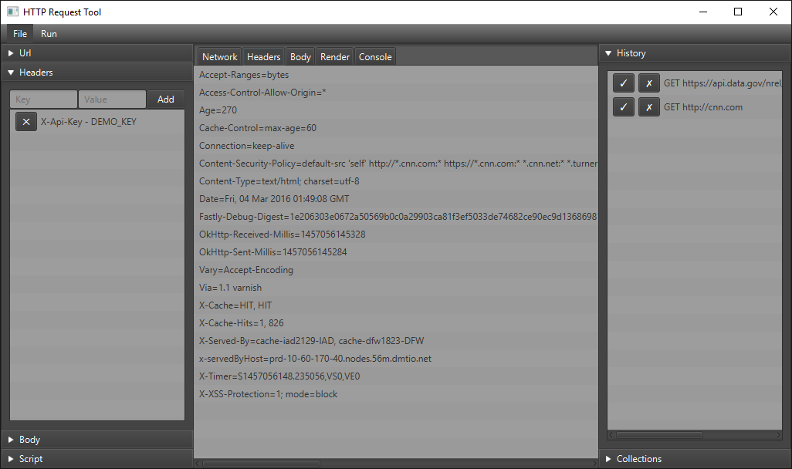

HTTP-Request-Tool
-----------------
Desktop application for creating and sending HTTP requests.

Usage
--------
Download the raw [HttpRequestTool-0.1.jar](HttpRequestTool-0.1.jar). Double-click or `java -jar HttpRequestTool-0.1.jar` to run.

Screenshot
------------

